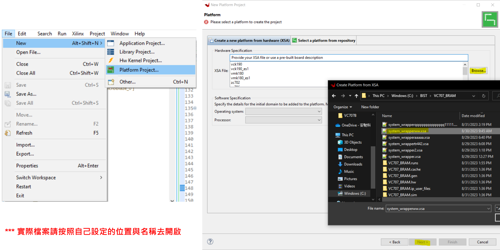
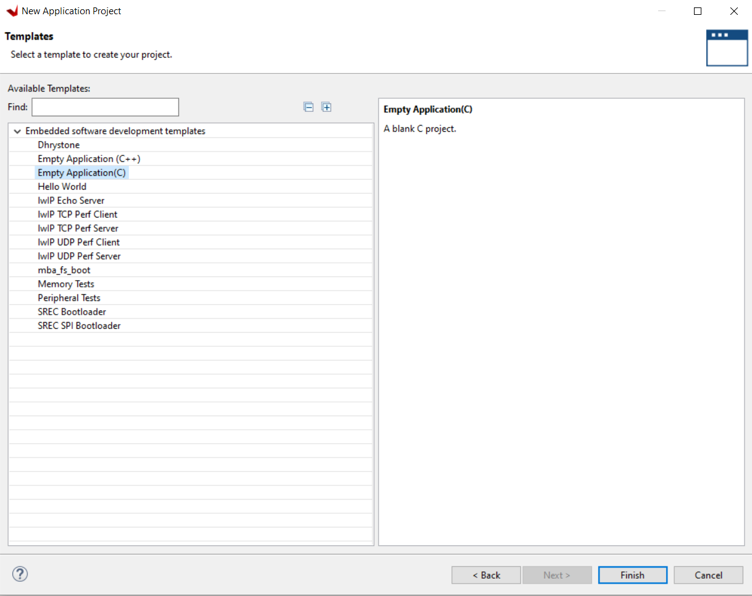

# VC707 BIST Flow
+ This article mainly explains how to conduct official peripheral function tests on the VC707

**Last update: 2024/05/03**

+ Vivado Version: 2021.1

+ The process has been migrated from Vivado 2014.1 to 2021.1

+ The vc707_bist bd.tcl file in the directory has already been modified for Vivado version 2021.1. If other versions are needed, modifications must be made accordingly

## Build VC707 BIST on Vivado

### 1. Open Vivado ---> Create and Package New IP, and extract the downloaded VC707 BIST files

+ You can directly download the pre-packaged vc707_bist from the directory

### 2. Select "Package a specified directory," and then choose the recently extracted vc707/gtxe2_top_v1_00_a/hdl directory

### 3. Package the IP and create the VC707 BIST Block Design

### 4. Select the MIG IP in the Block Design, and modify Clock 0 to 200 MHz

### 5. Add the Constraint File to the Source

### 6. Create the HDL Wrapper and generate the bitstream

### 7. Export XSA

## Build VC707 BIST Application on Vitis

### 8. Open Vitis and import the XSA exported from Vivado to create the Platform

### 9. Build Platform

### 10. Create an Application Project on the previously created Platform

### 11. Import the source code files from vc707_bist/vc707_bist_sdk_bist_app_src

### 12. Modify the variable names ReadBuffer, WriteBuffer, and InterruptController in xilflash_protection_example.c

### 13. Modify the value of MEM_OFFSET in bram_mem_test_example.c

### 14. Build and execute the BIST program on VC707

## APPENDIX A: Combine bitstream with .elf file(Only for MicroBlaze)

+ You can link the Vitis-built Application .ELF file with the hardware design in Vivado, and then regenerate the bitstream with the functions written in Vitis for direct programming in the future

+ For Zynq series, you can directly generate the Boot Image file (BOOT.bin) in Vitis

